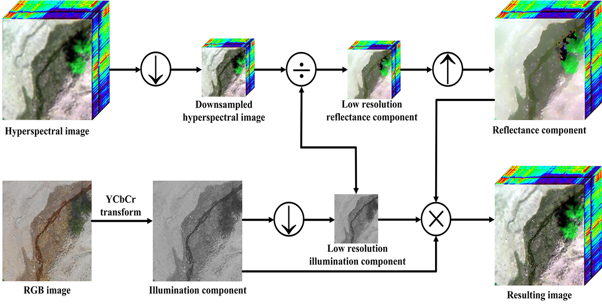

# This code is for paper "Component-Decomposition-Based-Hyperspectral-Resolution-Enhancement-for-Mineral-Mapping"

[Puhong Duan](https://scholar.google.ch/citations?hl=en&user=IYUlx_8AAAAJ&view_op=list_works&sortby=pubdate), [Jibao Lai](), [Pedram Ghamisi](https://scholar.google.ch/citations?user=Gr9afd0AAAAJ&hl=en), [Xudong Kang](https://scholar.google.ch/citations?user=5XOeLZYAAAAJ&hl=en), [Robert Jackisch](), [Robert Jackisch](), [Jian Kang](), [Richard, Gloaguen]()

___________

The code in this toolbox implements the ["Component decomposition-based hyperspectral resolution enhancement for mineral mapping"](https://www.mdpi.com/2072-4292/12/18/2903). More specifically, it is detailed as follow.

Citation
---------------------

**Please kindly cite the papers if this code is useful and helpful for your research.**

Duan P, Lai J, Ghamisi P, et al. Component decomposition-based hyperspectral resolution enhancement for mineral mapping[J]. Remote Sensing, 2020, 12(18): 2903.

    @article{MPCNN,
       title={Component decomposition-based hyperspectral resolution enhancement for mineral mapping},
       author={Duan, Puhong and Lai, Jibao and Ghamisi, Pedram and Kang, Xudong and Jackisch, Robert and Kang, Jian and Gloaguen, Richard},
       journal={Remote Sensing},
       volume={12},
       number={18},
       pages={2903},
       year={2020},
       publisher={MDPI}
     }

# Usage

Please input your data before running Main.m

